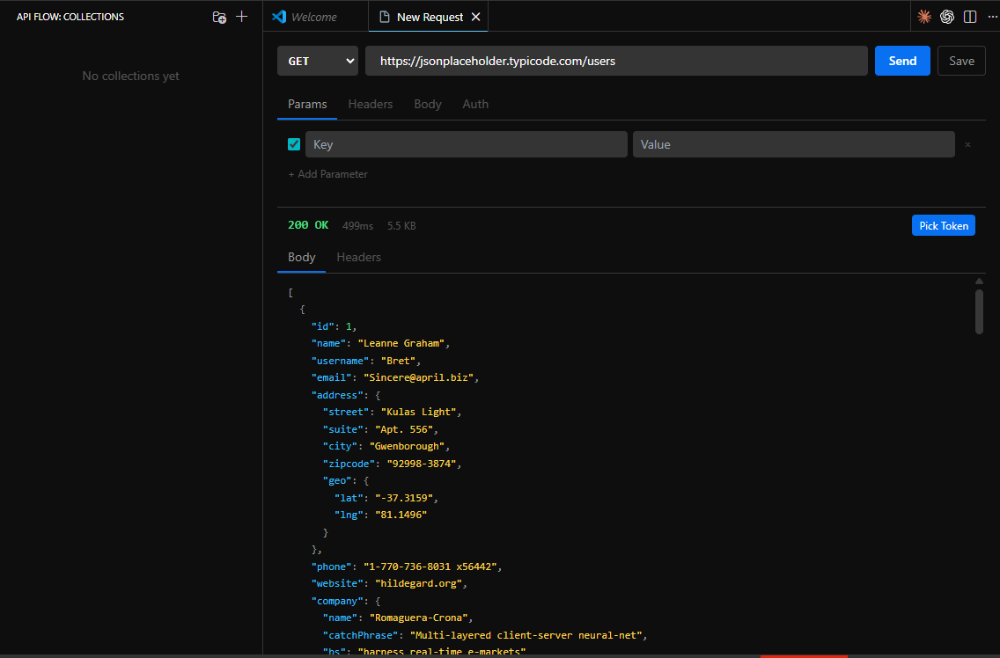
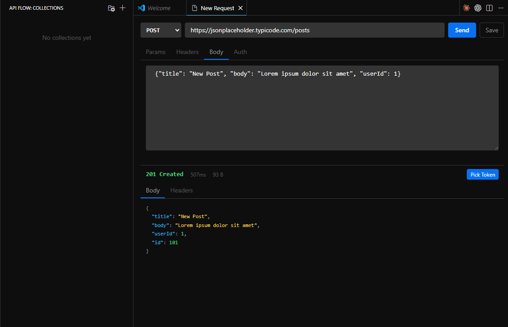

# API Flow

VS Code extension for testing APIs with built-in token management. Send a login request, pick the token from the response, and it gets injected into your next requests automatically.





## Features

- **Request Builder** — GET, POST, PUT, PATCH, DELETE with headers, query params and JSON body
- **Token Flow** — Pick a token from any JSON response, auto-inject it as Bearer header
- **Collections** — Save and organize your API endpoints
- **Environments** — Switch between dev/staging/prod with `{{variable}}` interpolation
- **Secure Storage** — Tokens stored via VS Code SecretStorage API

## Usage

1. Open Command Palette → `API Flow: New Request`
2. Enter URL, select method, add headers/body as needed
3. Hit **Send** (or `Ctrl+Enter`)

### Token Flow

1. Send a login/auth request
2. Click **Pick Token** on the response
3. Select the token field (e.g. `data.accessToken`)
4. All subsequent requests include `Authorization: Bearer <token>` automatically
5. Token status shown in the status bar — click to clear

### Collections

- Command Palette → `API Flow: New Collection` to create a group
- Click **Save** on any request to add it to a collection
- Sidebar shows all saved requests — click to reopen

### Environments

- Command Palette → `API Flow: Manage Environments`
- Define variables per environment (e.g. `baseUrl`, `apiKey`)
- Use `{{baseUrl}}/api/users` in your requests
- Switch environments from the sidebar dropdown
- Built-in variables: `{{$timestamp}}`, `{{$randomId}}`, `{{$guid}}`

## Tech Stack

- TypeScript + VS Code Extension API
- React + Tailwind CSS (Webview UI)
- Zustand (state management)
- Axios (HTTP client)
- esbuild + Vite (build)

## Development

```bash
npm install
cd webview-ui && npm install && cd ..
npm run build
```

Press **F5** in VS Code to launch the Extension Development Host.

## Build VSIX

```bash
npm run package
```
